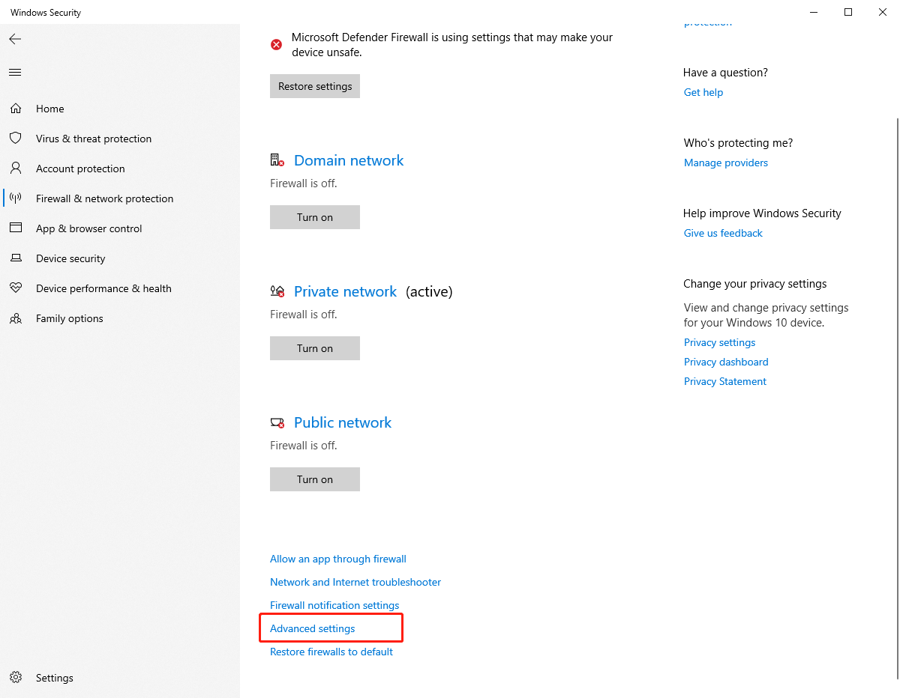
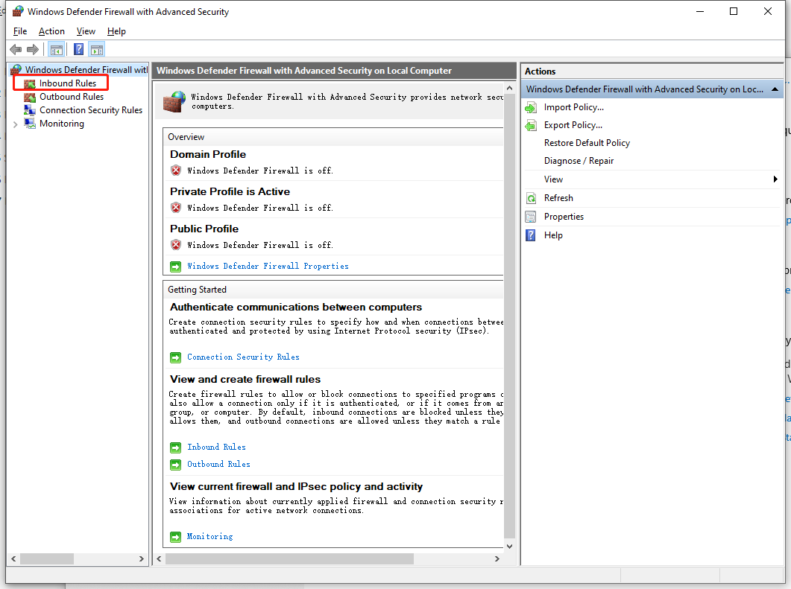
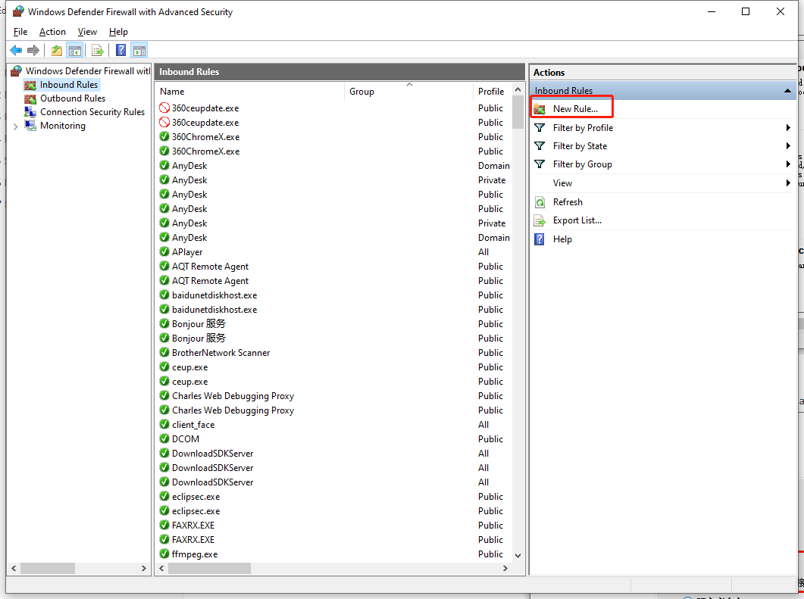
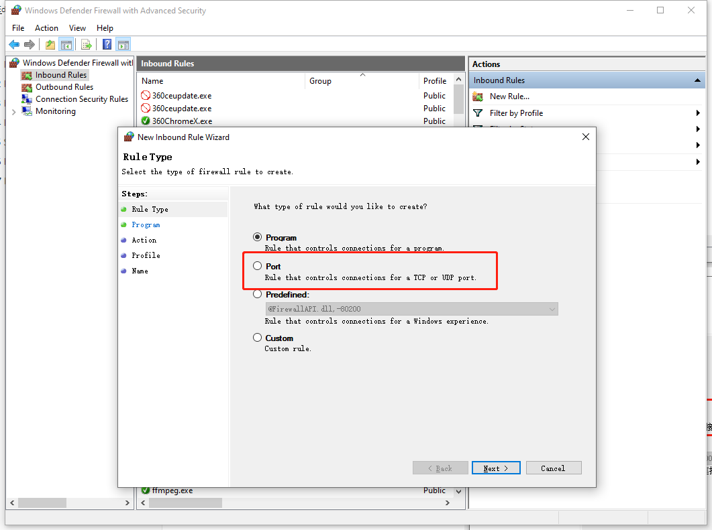

[toc]

# 1 Introduce

Instructions on how to start docker and use the client.


# 2 Pull image

```
docker pull auperastor/aupera_crowd:2.1.0
docker pull auperastor/stream:1.0.2
```
# 3 How to start stream
3.1  Create docker container
```
docker run -itd --name streaming -p 554:554 -p 10008:10008 auperastor/stream:1.0.2 bash
```
3.2 Go into docker
```
docker exec -it streaming bash
```
3.3 Run push videos
```
quick_start.sh
```
3.4 Check videos address
```
ps -x
```
# 4 Install docker and firmware

[Onedrive link](https://auperatechvancouver.sharepoint.com/:w:/s/customersupportdocument/EYBy1_LilLVEoF0EYEnov0kBLMVSpFn9wGX52eKs-v-7Wg?e=jTWc1j)


# 5 Start docker and AI service

## 5.1 Start docker
1. Create docker container
   - Port `56109` is the API server port of crowd flow
   - Port  `56110` is the API server port of car reid

```
sudo docker create --name aupera_crowd_app  -it --privileged=true -v /opt/aupera/crowd/:/opt/aupera/crowd/ -e NFS_ABS_PATH=/opt/aupera/crowd/ -p 56109:56109 -p 56110:56110 auperastor/aupera_crowd:2.1.0 bash
```
2. Start docker container
```
sudo docker container restart aupera_crowd_app
```
3. Active `DRM` and install AI application to U30
```
sudo docker exec -it aupera_crowd_app bash start.sh
```


# 6 How to use client

## 6.1 Car_reid

- Client pkg [Onedrive link](https://auperatechvancouver.sharepoint.com/:f:/s/SW/EtX-2Q8-EcREmZXPfCCIM6YBzlMC9ir-ieJwf12puvBUiw?e=nfIaZn)
- User Guide [Onedrive link ](https://auperatechvancouver-my.sharepoint.com/:b:/g/personal/dou_zhang_auperatech_com/EYWfFLszq1JLm_AtfCELgPsB-7II8DqKzRvZpjSsQcut1Q?e=otfNFv)  refer to step 6、7
- json_file [Onedrive link ](https://auperatechvancouver.sharepoint.com/:f:/g/EqYY7QtA3ItMkTovbfb6MmcBWTO8mW8us1RbYdqU04eBtw?e=UqBg2L) 

```
[server]
host = http://172.16.1.12:56110
port = 9003
language = en
first = 0
version = v2.0.4
notify_address = http://172.16.1.28:9003
notify_checkbox = 2
onvif_port = 57077
```

**Note**

- host=http://<IP>:<port>

  - IP is the device IP the application is running on. For U30, it is the x86 host IP.

  - Port is the API server port

     

##  6.2 Crowd_flow
- Client pkg  [Onedrive link](https://auperatechvancouver.sharepoint.com/:f:/s/SW/EvMDxtFO-15No0-d5Y4o0twBuLQbXFiiTvCzoTdDQAViVw?e=AARn67) 

-  User Guide  [Onedrive link ](https://auperatechvancouver-my.sharepoint.com/:b:/g/personal/dou_zhang_auperatech_com/Ec-mm7Aox4NHoVyjnYmi8yYBCvShdDWpO83wP30IXyIdbA?e=yBnstd)refer to step 6、7
  
  ```
  [server]
  host = http://172.16.1.16:56109 
  port = 9002
  language = en
  first = 0
  version = v2.0.4
  ```

**Note**

- host=http://<IP>:<port>

  - IP is the device IP the application is running on. For U30, it is the x86 host IP.

  - Port is the API server port

    

# 7 FAQ

## 7.1 Car_reid
### 7.1.1 Task crashes

- Login to manager device .

- Edit `D0/.aup_crowd_app/app.ini` and set `pipeline=1` to save pipeline log.

  ```
  # this is configs template for Aupera ai application
  # to use this configs, please copy this template to same folder and rename it to 'app.ini'
  # then reboot device
  
  # we don't support it persistence now
  [persistence]
  #enable = 0               ;task persistence. Default value is 1
  #recover_delay = 30       ;after the manager is started, it will be delayed for a period of time to read the persistent data and start the task. Deafult value is 30s
  
  [api]
  port =  56109              ; http server port. Default data is 44999
  
  [log]
  pipeline = 1               ;pipeline stderr/stdout will be save to /tmp/aup_*_*.log. Default value is 0
  reid_manager = 0           ;reid_manager stderr/stdout will be saved to /tmp/reid_manager_<api_port>.log
  notify = 0                 ;save reid_manager notification to /var/log/aup_crowd_app_manager/notify.log
  
  [task]
  recover = 0    ;if the task stops abnormally and has been running for more than 60s. if recover = 1, try to restart task
  
  [stream_ip_map]
  json_file = /D0/.aup_crowd_app/stream_ip_map.json
  ```

- Run`ps -x`command check manager port

- Run`screen -r aupm` `Ctrl + c` to stop manager

- Run`screen-S aupm -dm mc_manager --manager-port 44101 --worker-port 44102 --engine aup_crowd_app_manager`restart manager

- To start task again, and then `cd /tmp`check log messages to view pipeline log.


### 7.1.2 Client can't receive any result

- Login the manager device and then execute command: `cat /var/log/aup_crowd_app_manager/crowd_reid_upload.log | grep fail`

  1. If there are no logs, please check the input video and AI parameters are available.

  2. If the edge device fails to send notification to the client, please check whether the notification server IP is correct. You can use `ping` command to check.
  3. If notification server IP is correct, please turn off network firewall  or update the firewall of PC. For example:

  








## 7.2 Crowd flow

### 7.2.1 Client can't receive any result

- Login the manager device and the execute command:  `cat /var/log/aup_ai_app_manager/upload.log |grep fail `

- Please refer to 7.1.2 steps

  

## 7.3 Docker issue
### 7.3.1 Driver can't be installed

- Need to `rmmod xocl`install xdma

### 7.3.2 Can't see xdma_user
- Maybe try to reboot the machine 

##  7.4 Adjust the APP installation list

There is a configure file can adjust the application installation list. You can modify this list. 
```
{NFS_ABS_PATH}/CROWD-2.1.0/package/D0-image/ai_app_install.list
```